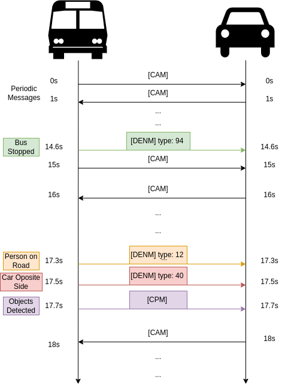

# Stopped Bus Safe Passage
### Abstract

Descrição da solução alcançada no projeto, com o objetivo de avisar os veículos adjacentes a um autocarro, sobre veículos a passarem na faixa contrária e peões na estrada, quando o autocarro está parado com os passageiros a desembarcar.

## Introdução

O mercado automóvel tem estado a caminhar para carros cada vez mais conscientes do ambiente em que estão envolvidos. Em geral essa informação vem dos sensores que estão integrados nos veículos mas com o avanço das redes veiculares e com os novos carros conectados entre si, podemos agora, obter uma imagem do ambiente em que um veículo está inserido não só através dos seus sensores integrados, mas também, através da informação que advém dos veículos próximos e até de unidades fixas na estrada, permitindo assim, construir uma imagem mais completa do que os rodeia.

O objetivo deste projeto é através das mensagens ETSI C-ITS, trocar informação que é obtida através do processamento de vídeo duma câmara montada numa dashboard de um autocarro, para informar sobre veículos a vir na faixa contrária e existência de peões na estrada. Este projeto foi testado no ambiente de simulação NAP-Vanetza que permite a troca de mensagens ETSI C-ITS. 

Por razões práticas não foi processada a livestream de uma câmara, mas sim de um vídeo obtido da plataforma Youtube que era do ponto de vista de uma dashboard de um veículo. Testámos com duas placas de desenvolvimento Nvidia Jetson em que uma representava um carro e outra o autocarro ambas ligadas num rede WiFi, e também um portátil ligado na mesma rede WiFi a mostrar uma dashboard para facilitar a visualização da demonstração.   

## Desenvolvimento

Começamos por desenvolver a deteção de carros na faixa contrária e peões num feed de vídeo. Para tal, foi utilizado o algoritmo de deteção em tempo real "YOLOv3". Foi escolhida a versão 3, pois é das versões menos pesadas computacionalmente e que mantém um nível de precisão bastante bom, o que é o cenário ideal para correr numa Nvidia Jetson que não tem poder computacional suficiente para correr modelos mais pesados e precisos. 

A implementação deste algoritmo foi baseado na Darknet, que é uma rede neuronal open source escrita em C e CUDA. A Darknet já está pré treinada conseguindo detetar vários objetos, estes definidos no ficheiro chamado "coco.names". Existem vários modelos desta rede neuronal, e destes, nós escolhemos dois para testarmos. O modelo "YOLOv3-tiny" e o modelo "YOLOv3-608" podendo ver as especificações de cada um na figura \ref{fig:modelos}. 

O processamento de deteção de objetos é feito em CUDA cores (Nvidia GPU) caso existam, ou caso contrário corre totalmente em CPU. O programa é em geral, um loop infinito que alimenta cada frame do vídeo para a rede neuronal (Darknet) que nos dará, na layer de output, os scores de previsão de cada classe de objetos, para todos os objetos detetados naquela frame. De seguida escolhemos apenas aqueles que têm uma confiança de previsão acima dos 80\%, e desses apenas os objetos com classe "carro" ou "pessoa". É possível verificar esta previsão através duma janela que mostra os objetos detetados com um retângulo à sua volta e com o nome da classe.

Seria possível melhorar significativamente a performance de deteção de objetos se voltássemos a treinar a rede para detetar apenas pessoas e carros, que são os únicos objetos que nos são interessantes.

Após a deteção estar desenvolvida passámos para a criação dos programas que enviavam as mensagens ETSI C-ITS. Foram desenvolvidos dois programas, um que representa um carro e outro que representa o autocarro. Ambos os programas percorrem um ficheiro CSV em que cada linha contém as informações necessárias para uma mensagem CAM. 

De linha em linha passa um segundo, isto é, são enviadas mensagens CAM à frequência de 1Hz. Ambos os programas estão conectados aos seus respetivos brokers mqtt do NAP-Vanetza. Depois juntámos a aplicação que faz a deteção no vídeo à aplicação que faz a troca de mensagens do autocarro com o auxílio de threads em Python. Precisámos de verificar quando é que o autocarro estava parado a desembarcar, para saber quando é que era necessário enviar informação sobre os veículos a vir na faixa contrária, fizemos isto verificando a sua velocidade, a cada segundo, quando estivesse a zero indicava que o autocarro estava parado. Para a thread que corria a deteção no vídeo de objetos saber quando é que tinha de enviar informação sobre os carros usámos uma variável partilhada. 

A partir do momento em que conseguimos realizar a troca de mensagens CAM, DENM e CPM entre os programas, avançámos para desenvolvimento de uma dashboard para facilitar a visualização do movimento dos veículos e das mensagens CPM e DENM que o autocarro gera mediante o que está a observar e como se está a movimentar. 
São enviadas mensagens DENM com as causas e subcausas 12, 40, 94. A causa 12 que indica quando uma pessoa está na estrada é enviada sempre que é detetada uma pessoa no feed de vídeo. As mensagens DENM com causa 40 que é um tipo não definido no standard mas que nós definimos para indicar quando está a vir um carro na faixa contrária, só são enviadas quando o autocarro está a desembarcar pessoas, se for detetado algum carro na faixa contrária. As mensagens DENM com causa 94 estão definidas e servem para indicar que está um veículo estacionário na via, são enviadas sempre que o autocarro está desembarcar pessoas. As mensagens CPM contêm o que é detetado no feed de vídeo e a percentagem de confiança dessa deteção, são enviadas pelo autocarro sempre que é detetado uma pessoa, mas só é incluído os carros detetados se o autocarro estiver estacionário a desembarcar.

Estão a ser usadas duas Nvidia Jetsons que representam os veículos, uma para o carro e outra para o autocarro, que correm os seus containers respetivos do NAP-Vanetza e as suas aplicações que são usadas para criar as mensagens CAM mediante um ficheiro CSV, e no caso do autocarro também são criadas as mensagens DENM e CPM, em relação ao que está a ser observado no feed de vídeo e em relação ao momento de desembarque. O portátil é usado para correr um container docker que contém a web dashboard, desenvolvida em Reactjs, e um proxy server que lança duas threads, uma delas que corre um cliente MQTT subscrito nos tópicos das mensagens ETSI C-ITS de ambas as OBUs e que redireciona essa informação, através de variáveis globais partilhadas entre threads, para a segunda thread que está a alocar um servidor de WebSockets. Por sua vez o dashboard irá conectar-se nos portos do servidor WebSocket, onde irá buscar toda essa informação. Todos estes dispositivos estão ligados numa rede WiFi criada por uma das Jetsons. Tentámos estabelecer conexão através de uma rede ad-hoc WiFi mas as placas de rede dos dispositivos não permitiam esse modo.

## Testes

Criámos um cenário em que um carro segue um autocarro. Num dado instante o autocarro cessa o seu movimento e mantém-se parado durante alguns instantes, para simular um desembarque de passageiros. Depois segue até um dado ponto e acaba a simulação. Durante este cenário ambos os veículos enviam as respetivas mensagens CAM e o autocarro envia as mensagens CPM em relação ao que está a observar num vídeo obtido do Youtube, que foi descarregado para a placa, e se for necessário envia as mensagens DENM mediante a situação da simulação. 

Os ficheiros CSV com parte das informações necessárias para as mensagens CAM, isto é, que definem as coordenadas de cada veículo, velocidade e orientação, foram criados com o auxílio de uma aplicação, GeoTrace. O GeoTrace é uma aplicação que faz o tracing do GPS em junção com os dados de orientação num smarphone ao longo do tempo, e pode se definir a frequência com que estes dados são recolhidos ao longo do tempo, no nosso caso foram recolhidos à frequência de 1Hz. 

No final do rastreamento a aplicação permite gerar um ficheiro CSV com os dados recolhidos. Os dados usados para os testes foram recolhidos usando um automóvel com o rastreamento do GeoTrace ligado num smarphone, que percorreu duas trajetórias, a do carro e a do autocarro.

## Resultados

Em geral conseguimos desenvolver todos os objetivos propostos, sendo eles: a deteção de pessoas e veículos através de um feed de vídeo, sendo possível adaptar para uma câmara em tempo real facilmente, o autocarro avisar os carros em redor que está parado e/ou que circula um carro na via contrária e/ou que circula uma pessoa na via, separar as entidades em diferentes entidades de processamento e ligá-las através de uma rede WiFi.

Foi também falado na possibilidade do autocarro enviar o feed de vídeo para os carros em redor para facilitar manobras de ultrapassagem, porém não foi implementado.

## Linha cronológica da demonstração

## Conclusão

O desenvolvimento do projeto foi bem sucedido, uma vez que conseguimos implementar o cenário e objetivos propostos, porém não conseguimos estabelecer a conexão através de uma rede ad-hoc WiFi, visto que as placas de rede dos dispositivos não nos permitiram esse modo e apenas foi possível conectar através de uma simples rede WiFi.

### Authors

Development of Vanetza is part of ongoing research work at [Technische Hochschule Ingolstadt](https://www.thi.de/forschung/carissma/labore/car2x-labor/).
Maintenance is coordinated by Raphael Riebl.

Development of NAP-Vanetza is part of ongoing research work at [Instituto de Telecomunicações' Network Architectures and Protocols Group](https://www.it.pt/Groups/Index/36).

Questions and Bug Reports: @rrosmaninho / r.rosmaninho@av.it.pt

Development of NAP-Vanetza-Stopped-Bus-Safe-Passage is part of Project done in pratical classes of Redes e Sistemas Autónomos at [Course Engenharia de Computadores e Telemática in University of Aveiro](https://www.ua.pt/).

Questions and Bug Reports: @danielvcorreia / @joaquimo-oramos

### License

Vanetza is licensed under LGPLv3, see [license file](LICENSE.md) for details.
